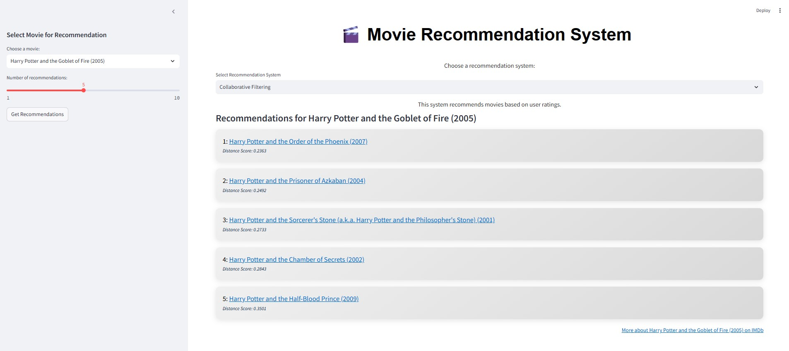
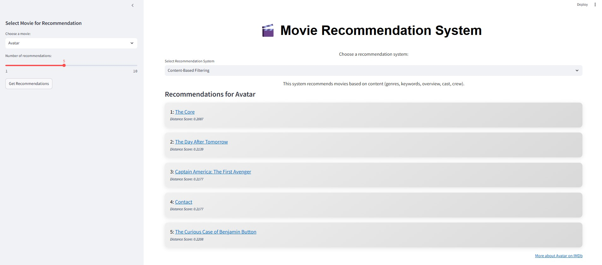

# ML-Movie-Recommendation-System

## Overview
This project implements a movie recommendation system combining **Collaborative Filtering** and **Content-Based Filtering** methods. Using Python, Streamlit, and Power BI, the system offers personalized movie recommendations based on user ratings and movie content, alongside insightful visualizations of the movie data.

## Key Features
- **Collaborative Filtering** using **KNN** and **Cosine Similarity**.
- **Content-Based Filtering** using **TF-IDF Vectorization** and **KNN**.
- **Interactive App** built with **Streamlit** to provide movie recommendations.
- **Data Visualizations** using **Power BI** to explore movie trends and user preferences.

## Datasets Used
- **Ratings Dataset:** Contains user ratings for various movies.
- **Movies Dataset:** Provides details about movies (titles, genres).
- **TMDB Movies Dataset:** Features such as genre, budget, vote average, etc.
- **TMDB Credits Dataset:** Movie cast and crew details.

## Run the Streamlit app:
   ```bash
   streamlit run app.py
   ```

## My Project

Images from my project:





